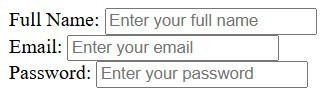
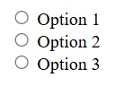
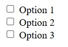
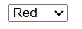
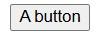
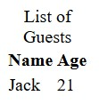
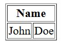
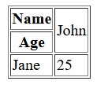

# HTML Fundamentals

HTML stands for **HyperText Markup Language**, which is the standard coding language used to create and structure content for the web (such as HTTP AND HTTPS), acting as a fundamental building block of all web pages by defining elements like headings, paragraphs, links and images using tags that web browsers interpret to display information. But it is key to remember, that HTML is **not a programming language, but a markup language**, meaning that it annotates text to define how it's structured and displayed.
HTML is also a **Static language**, where it does not inherently provide interactive features, but can be combined with `CSS` for styling and `JavaScript` for interactivity.

## HTML Basics and Structure:

### The Basic Structure of an HTML:

Every HTML document follows a simple structure:

#### The `<!DOCTYPE html>`:

At the very top (line 1), it starts with `<!DOCTYPE html>`, telling us **which version of HTML** that we are using. This will be then, followed by the `<html>` tag, containing **all of the HTML content**.

#### `<HTML>`:

Inside the `<html>` tag, we add the `<body>` tag, which holds all of the visible content of the web page. Here is a simple example:

```html
<!DOCTYPE html>
<html>
    <body>
        This is some text.
    </body>
</html>
```

From the above example, you are given the base code of an HTML page, and inside the `<body>` tag, there is a text, which will be displayed on the webpage as content.

### Elements and Tags:

In HTML, the **tags** are represented as **keywords enclosed in angle brackets**, like the simple `<html>`. They tell the browser how to display the content. The **elements** are the **components of an HTML document**, consisting of a start tag, content and an end tag. Here's a simple breakdown:

#### Tags:

```html
<html> <!-- Singular tag for representation -->
```

This singular `<html>` tag is just a keyword within double angle brackets that define how content is displayed.

#### Elements:

```html
<html>
    <body>
        <!-- These would be considered as elements, with opening and closing tags! -->
    </body>
</html>
```

In the other hand, the elements are components made up of a start tag, content inside that block for that tag, and an end tag, which can be identified with the `</body>` syntax ("/").

```html
<p>This is a paragraph.</p>
```

For that example, the `<p>` is the start tag, "This is a paragraph." is the content, and the `</p>` is the end tag. Together, they form a paragraph element!

### Nesting and Closing Tags:

In HTML, nesting means placing an element inside another. For example, you can put the `<strong>` tag inside the `<p>` tag to make the text bald within a paragraph.
Here is how it looks:

```html
<p>This is <strong>bold</strong> text.</p>
```

**Closing tags are crucial**, it is mandatory that every start tag must implement an end tag, rementioning that the end tag has a **/** bar at the beginning of a keyword (left-side). This can be seen in the above code, the `<p>` is the start, we have the content inside between the start and end tags, and the `</p>` represents the end tag.

#### Issues with Incorrect Nesting:

Incorrect nesting can lead to rendering issues, so make sure to always close tags in the correct order. The inner tag should be closed before the outer tag.

##### Correct Nesting:

```html
<p>This is <strong>bold</strong> text.</p>
```

##### Incorrect Nesting:

```html
<p>This is <strong>bold text.</p></strong>
```

### Comments:

Comments are a feature used commonly for documenting parts in your code, but they are mainly known as **notes that don't appear in your program or web page**. They are useful for:

- Explaining complex code;
- Leaving notes for other or yourself;
- Temporarily disabling code.

#### Syntax:

In HTML, comments are written between `<!--` and `-->`.

```html
<!-- This is a comment -->
<p>This is a paragraph.</p>
```

#### Disabling Content:

You can also use comments to not exhibit content or disable functioning code in your html document.

```html
<!DOCTYPE html>
<html>
    <body>
        <p>
            <!--Hello <strong>boys</strong>!-->
        </p>
    </body>
</html>
```

## Text and Formatting:

### Headings:

You are probably not going to use only plain text into your website, right? 
If you would like to add a title or a section name, the best way is to utilize **headings**. Note that there are **six levels of headings**, from `<h1>` (the most important) to `<h6>` (the least important). Here is an example of usage:

#### Example of Usage:

```html
<h1>This is a main heading</h1>
<h2>This is a subheading</h2>
<h3>This is a sub-subheading</h3>
```

#### Purpose of Headings:

Headings help **organize your content** and make it easier for people or users to **search engines to understand your page**.

* `<h1>`: Represents the main title of the webpage (the most important);
* `<h2>`: Subheading;
* `<h3>`: Sub-subheading;
* `<h4>` and `<h5>`: Other sub-sub-headings;
* `<h6>`: The least important heading.

With all these headings, you can construct something that looks similar to this:

```html
<h1>Welcome to My Website</h1>
<h2>About Me</h2>
<h3>My Hobbies</h3>
<h4>Reading</h4>
<h5>Fiction</h5>
<h6>Favorite Authors</h6>
```

#### How to use Headings Well:

- Use only **one `<h1>` per page** for the main title;
- Use headings to create a **logical structure**, you can think of them as an outline;
- **Never skip heading levels**, for example: Don't jump from `<h1>` to `<h4>`;
- Use headings for structure, not for styling, because **CSS** will take over that part and will prioritize for appearance;
- Headings help with accessibility and SEO (Search Engine Optimization), they make your content easier to navigate for users and search engines.

##### Example of Good Heading Structure:

```html
<h1>HTML Fundamentals</h1>
<h2>Introduction</h2>
<h2>HTML Basics</h2>
  <h3>Elements and Tags</h3>
  <h3>Nesting</h3>
<h2>Formatting Text</h2>
```

#### Summary:

Use headings to organize your content clearly, making it easy for both people and search engines to **understand your page's structure**. Always start with `<h1>` (once per page!), then use `<h2>`, `<h3>` and etc... as needed for subsections.

### Paragraphs:

In HTML, paragraphs are used to **show blocks of text**, where you would define them inside the `<p>` and `</p>` tags. Note that when you put text between the `<p>` and `</p>` tags, the browser will display it as a separate paragraph with some space above and below it. Here is how you can add a paragraph in HTML:

```html
<p>This is a paragraph.</p>
<p>This is another paragraph.</p>
```

> [!NOTE]
> If you are creating an article, the **title** would be a heading `<h1>`, and the **actual text** would be the paragraph `<p>`.

#### Example of a Paragraph:

```html
<!DOCTYPE html>
<html>
    <body>
        <p>Welcome to our pizza restaurant!</p>
        <p>Explore our menu today.</p>
    </body>
</html>
```

#### Combining Headings with Paragraphs:

```html
<!DOCTYPE html>
<html>
    <body>
        <p>
            <h1>Welcome to My Website</h1>
            <h2>About Me</h2>
            <p>My name is Vimto, and I code for living</p>
        </p>
    </body>
</html>
```

### Line Breaks:

In HTML, the `<br>` tag is used to create a **line break**, which can be useful when you want to start text on a new line without having to start another paragraph. Unlike the `<p>` tag, which adds a blank line before and after the text, the `<br>` tag simply moves the text to the next line.
Here's how you can use the `<br>` tag in HTML:

#### Example of Usage:

```html
<p>This is a line.<br>This is another line.</p>
```

When using the `<br>` tag, you won't necessarily use the end tag for the `<br>` line breaker tag since we just want to move one part of the text to the next line...

On the example above, "This is a line." will be displayed above "This is another line.", successfully separating the text in half and displaying the text in separate lines. The `<br>` tag is an **empty element**, which means that it **doesn't have an end tag**. So you would just simply write the `<br>` tag where you want the line break to occur.

### Bold and Italic Text:

In HTML, you can style text easily!

* Make it bold with the `<strong>` tag;
* Make it italic with `<em>`.

These tags help emphasize important words and making them stand out!

#### Example of Usage:

```html
<p>This is normal text</p>
<p>This is <strong>bold</strong> text</p>
<p>This is <em>italic</em> text</p>
```

In the example above, the word "bold" will be displayed in bold, while the "italic" word will be displayed in italics.

#### Other Bold and Italic Tags:

There are another two different tags that can be used to make your text bold or in italics:

- `<b>`: Bold;
- `<i>`: Italic.

Here is an example:

```html
<p>This is normal text. <b>This is bold text</b>. <i>This is italic text</i>.</p>
```

### Recap - Text Formatting:

* **Headings**: Use `<h1>` up to `<h6>` tags to create headings with different levels (most to least important);
* **Paragraphs**: Use `<p>` and `</p>` to construct paragraphs, where browsers automatically generate a space above and below each paragraph;
* **Line Breakers**: Use `<br>` when needing to separate text into other sections;
* **Bold and Italic**: Use `<strong>` and `</strong>` (or `<b>`) for making text bold, and `<em>` or `<i>` for italics!

Here is an example that combines all of the mentioned tags:

```html
<h1>Main Heading</h1>
<p>This is a <strong>bold</strong> paragraph. Here is a line break:<br>This is <em>italic</em> text.</p>
```

In this example, we have a main heading, a paragraph with bold and italic text, and a line break within the paragraph. This demonstrates how to use different formatting tags together to create well-structured and styled content.

## Working with Lists:

### Unordered List:

In HTML, an **unordered list** is a list of items that are **not ordered by numbers or letters**. Instead, each item is marked with a **bullet point**. To create an unordered list, you would use the `<ul>` and the `</ul>` tags (marks the structure). Each item in the list is defined using the `<li>` and `</li>` tags (they would represent the bullet points).

> [!NOTE]
> Remember, `<ul>` stands for **Unordered List** and the `<li>` stands for a **list item**!
> If you don't remember what tags or elements to use, always be aware of the letters within the elements and tags.

#### Example of Usage:

```html
<ul>
  <li>Item 1</li>
  <li>Item 2</li>
  <li>Item 3</li>
</ul>
```

In this example, the `<ul>` tag defines the unordered list, and each `<li>` tag represents a list item. When displayed in a browser, this code will create a list with bullet points:

```
* Item 1
* Item 2
* Item 3
```

#### Why use Unordered Lists?

Unordered lists are useful when presenting items that do not consist of **any order**, such as a list of ingredients or features.

### Ordered Lists:

Now an **ordered list** is a list of items that are ordered by numbers or letters. To create an ordered list, you would use the `<ol>` and `</ol>` tags, and each element in the list is defined using the `<li>` and `</li>` tags (similar to the unordered list).

The `<ol>` tag stands for **Ordered List**.

#### Example of Usage:

```html
<ol>
  <li>First item</li>
  <li>Second item</li>
  <li>Third item</li>
</ol>
```

In this example, the `<ol>` tag defines the ordered list, and each `<li>` tag represents a list item. When displayed in a browser, this code will create a numbered list:

```
1. First item
2. Second item
3. Third item
```

#### Why use Ordered Lists?

Ordered lists are useful for presenting items where the **order matters**, such as steps in a procedure or a list of ranked items.

### Nested Lists:

Did you know that you can place **one list inside another?** 
This feature is so called **nested lists**, this can be useful for creating hierarchical structures, such as outliers or multi-level menus. 

#### Creating a Nested List:

Now, to create a nested list, you simply add the `<ul>` or the `<ol>` element inside the outer `<i>`, `<li>` or `</i>` element of another list. Here's an example of a nested unordered list:

```html
<ul> <!-- This tag will be the outer list -->
  <li>Item 1</li>
  <li>Item 2
    <ul> <!-- This would be the inner list -->
      <li>Subitem 2.1</li>
      <li>Subitem 2.2</li>
    </ul>
  </li> <!-- When nesting, always have an end tag for legible and efficient nesting -->
  <li>Item 3</li>
</ul>
```

> [!NOTE]
> The second item `Item 2` contains a nested list of two subitems: `Subitem 2.1` and `Subitem 2.2`.

In the browser, it will look similar to this:

```html
* Item 1
* Item 2
    - Subitem 2.1
    - Subitem 2.2
* Item 3
```

You can also nest ordered lists or mix them up!

### Recap - Lists:

* **Unordered Lists `<ul>`:** Use `<ul>` and `</ul>` for creating an unordered list (with bullet points), each item is defined using the **item list tags `<li>` and `</li>`**;
* **Ordered Lists `<ol>`:** Use `<ol>` and `</ol>` for creating a numbered list, where each item is also defined with `<li>`;
* **Nested Lists:** Place one list inside another by putting either the `<ul>` or `<ol>` inside the inner `<li>` tag of another list, then use any of the lists as mentioned!

Here is an example of all of the lists being used in a webpage: A Todo List

```html
<!DOCTYPE html>
<html>
  <body>
    <h1>My Todo List</h1>
    <ol>
      <li>Morning
        <ul>
          <li>Wake up at 5:00 AM</li>
          <li>Brush my teeth</li>
          <li>Read a book of choice</li>
        </ul>
      </li>
      <li>Afternoon
        <ul>
          <li>Touch some grass</li>
          <li>Do my homework</li>
          <li>Go to the gym</li>
        </ul>
      </li>
      <li>Evening
        <ul>
          <li>Stretch</li>
          <li>Play games</li>
          <li>Sleep</li>
        </ul>
      </li>
    </ol>
  </body>
</html>
```

## Adding Content:

### HTML Attributes:

In HTML, **attributes** provide additional information about elements. They are used to define properties of an element, such as its size, color or behavior. Attributes are always specified in the start tag and usually come in `name/value` pairs like `name=value`.

#### General Syntax:

Here is a general syntax for adding attributes into an HTML element:

```html
<tagname attribute1="value1" attribute2="value2">Content</tagname>
```

- `tagname`: Name of the HTML element, for example: (`<p>`, `<strong>`, `<h3>`);
- `attribute1` and `attribute2`: Names of the attributes;
- `value1` and `value2`: The values assigned to those attributes.

### Links:

In HTML, a **link** (or a hyperlink) is an element that connects **one webpage to another**. 

You can create links to other webpages, files, locations within the same page or any other URL. Links are create using the `<a>` tag. The `<a>` tag stands for **anchor**.

#### Basic Syntax:

Here is the basic syntax for making links in HTML:

```html
<a href="url">Link text</a>
```

- `<a>`: The opening anchor tag;
- `href`: The destination URL of the link;
- `Link text`: The visible text that users will see and click on;
- `</a>`: The closing anchor tag.

#### Link to Google's Homepage:

```html
<a href="https://www.google.com">Visit Google</a>
```

In this example, when a user clicks on the text "Visit Google", they will be taken to `https://www.google.com`.

#### Multiple Links:

##### Links Next to Each Other:

```html
<!DOCTYPE html>
<html>
  <body>
    <a href="https://coddy.tech">Visit Coddy </a>
    <a href="https://www.google.com">Visit Google</a>
  </body>
</html>
```

##### Separate Links:

```html
<!DOCTYPE html>
<html>
  <body>
    <p>
      <a href="https://coddy.tech">Visit Coddy </a>
    </p>
    <p>
      <a href="https://www.google.com">Visit Google</a>
    </p>
  </body>
</html>
```

### New Page Links:

You can also create links that open on a **new tab or window** by using the `target` attribute with the value `_blank`:

#### Basic Syntax:

```html
<a href="https://www.example.com" target="_blank">Visit Example</a>
```

> [!NOTE]
> This will open the link in a new tab or window, but this will depend on the user's browser settings!

### Images:

Images can make your webpages more engaging, and adding them into HTML is simple! Use the `` tag for inserting images with ease. The `` tag is self-closing, so it does not require an end tag.

#### How to Insert an Image:

To insert an image, use the `src` attribute to specify the image's location (can be made by either referring the URL or file path location). Here's an example:

##### Insertion Via URL:

```html

```

In this example, the browser will load up and display the image from the URL `https://coddy.tech/images/bit.svg`.

##### Insertion Via File Path:

```html
" />
```

Or if the image is in the same folder as your HTML file:

```html

```

### Image Attributes:

Here are some additional image attributes to improve your image manipulation and exhibition:

#### `alt`:

The **`alt`** attribute provides alternative text if the image doesn't load, for example:

```html

```

#### `width` and `height`:

These two attributes control the size and height of an image in pixels.

```html

```

And if you combine these features, you should get something like this:

```html

```

This would set the image source, provide a brief description, and sizes of 600x400 pixels. Always include an `alt` for accessibility and dimensions to maintain design consistency.

## Page Layout:

### Divisions:

Imagine that you would like to split you webpage into segmented blocks to organize your content. In HTML, you can use the `<div>` to group elements together. 
The `<div>` (division) tags are handy for creating layouts and separating sections. Here's the basic syntax:

#### Basic Syntax:

```html
<div>
    <!-- Content goes here -->
</div>
```

> [!NOTE]
> You can add other HTML elements inside a `<div>` tag, such as paragraphs, headings, images, and even nest other `<div>` elements!

#### Example of Usage:

Here, the `<div>` is being used to construct a simple layout with a header, main content area and a footer.

```html
<div>
    <h1>Header</h1>
</div>
<div>
    <p>Main content goes here.</p>
</div>
<div>
    <p>Footer</p>
</div>
```

### Inline Spans:

Imagine that you have a sentence and you wish to highlight one word or a small part of it, what would you do to handle this case? Use a `<span>` tag? Well the answer is crystal clear!

We can use the `<span>` tag to apply styles or make changes to only a specific part of a text without affecting the rest. 

#### Basic Syntax:

```html
<span>This is some text.</span>
```

#### Highlighting a Portion of Text:

```html
<p>
  This is a <span style="color:blue;">blue</span> word.
</p>
```

The `style` attribute within the `<span>` tag is applying a blue paint in the "blue" word, and the rest of the sentence remains the same color!
This is just an introduction to style attributes, we will learn them next lesson!

### Semantic Tags:

The **semantic tags** in HTML help define the meaning of content, making the code clearer for both developers and browsers. Unlike `<div>` and `<span>`, they give context to the enclosed content.

#### Common Semantic Tags:

* `<header>`: Introductory content, usually at the top;
* `<nav>`: Contains navigation links;
* `<main>`: Main content of the page;
* `<article>`: A self-contained piece like a blog post;
* `<section>`: Groups related content, often with a heading;
* `<footer>`: Bottom section with info like copyright or contact details.

#### Example of Usage:

```html
<header>
    <nav>
        <ul>
            <li><a href="#">Home</a></li>
            <li><a href="#">About</a></li>
            <li><a href="#">Contact</a></li>
        </ul>
    </nav>
</header>
<main>
    <article>
        <h2>Article Title</h2>
        <p>Article content goes here.</p>
    </article>
</main>
<footer>
    <p>Copyright 2023</p>
</footer>
```

This structure provides a clear and meaningful layout for the content.

### Sections and Articles:

The `<section>` and `<article>` tags are used to **organize content into logical parts**.

#### `<section>`: 

The `<section>` tag defines a section in a document, such as chapters, headers, footers and any other sections of the document. This can be seen as a way to group content together, for example, you might use `<section>` to divide a page into an introduction, content and contact information. Here is how to use `<section>`:

```html
<section>
    <h2>Section Heading</h2>
    <p>Section content goes here.</p>
</section>
```

#### `<article>`:

In the other hand, the `<article>` tag specifies independent, self-contained content. I should make sense on its own and also possible to read it independently from the rest of the website. Examples of where an `<article>` element should be used: In a forum post, a blog entry, a news story or a comment. Here you can see the `<article>` tag being utilized:

```html
<article>
    <h2>Article Title</h2>
    <p>Article content goes here.</p>
</article>
```

### Recap - Layout:

* **Divisions**: Use `<div>` tags to create containers that group other elements together, as they are block-level elements, taking up the full width available;
* **Inline Spans**: Use `<span>` tags to create inline containers for text or inline elements, they only take up as much width as necessary;
* **Semantic Tags**: Utilize tags like `<header>`, `<nav>`, `<main>`, `<article>`, `<section>` and `<footer>` to structure your content meaningfully.

Here is an example of a webpage which utilizes all of the tags that we have learned:

```html
<!DOCTYPE html>
<html>
  <body>
    <header>
      <h1>My Website</h1>
      <nav>
        <ul>
          <li>Home</li>
          <li>About</li>
          <li>Contact</li>
        </ul>
      </nav>
    </header>
    <main>
      <div>
        <p>This is the <span>main</span> content area</p>
      </div>
      <section>
        <h2>About Us</h2>
      </section>
      <article>
        <h3>Our Mission</h3>
        <p>Some Text...</p>
      </article>
    </main>
    <footer>
      <p>Copyright 2024 My Website</p>
    </footer>
  </body>
</html>
```

## Forms and Inputs Part 1:

### Form Basics:

In HTML, **forms** are used to **collect user input**, where a **form** is a sections of a document that contains controls such as text fields, buttons, checkboxes and much more. Users can interact with these controls to provide data, which can then be sent to a server for processing. 

#### Essentials of Forms:

Forms are essential for **creating interactive webpages** that follow users to **submit information**, such as login credentials, search queries or feedback. It is key to remember that it is **compulsory** to insert any type of user input **inside the `<form>` tag**, guaranteeing that all user input is sent to the server and submitted correctly!

#### Basic Syntax:

Here is a basic syntax and structure of a form with the `<form>` tag:

```html
<form>
    <!-- Form elements go here -->
</form>
```

### Text Inputs:

The **text inputs** are used to **create form fields** where users can **insert text by typing**. There are various types of text inputs, each designed for different kinds of text-based data. The most common type is the **single-line text input**, created using the `<input>` tag with the `type` attribute set to "text".

#### Syntax for `<input>` Tag:

Here is the following syntax for creating a text input in HTML:

```html
<form>
  <input type="text" name="fieldname">
</form>
```

* `<input`: The tag that defines the input field;
* `type="text"`: An attribute that specified the input type as text;
* `name`: An attribute that gives the input field a name, which is used to identify the data when the form is submitted.

> [!NOTE]
> The `<input>` is a special tag (self-closing tag), not requiring the closing tag at the end!
> And it is also **good practice** to maintain the `<input>` tag inside the `<form>` tag, ensuring that any user input is submitted, allowing the browser to handle validation and accessibility features correctly.

### Input Attributes:

Here I have listed some useful attributes for text inputs:

#### List of handy Attributes:

* `placeholder`: Provides a short hint that describes the expected value of the input field (e.g. "Enter your name");
* `value`: Sets the initial value of the input field;
* `maxlength`: Specifies the maximum number of characters allowed within the input field.

#### Example of Usages:

For the first example, we demonstrate how we use the `placeholder` attribute in an `<input>` tag:

##### Using 'placeholder':

```html
<form>
  <input type="text" name="username" placeholder="Enter Username">
</form>
```

##### Using 'value':

By default, the text box would already be holding the number "0" as a number type, not a text type!

```html
<form>
  <input type="number" name="numberfield" value="0">
</form>
```

##### Using 'maxlength':

The HTML code below will allow the insertion of 8 characters at maximum.

```html
<form>
  <input type="text" name="textfield" maxlength="8">
</form>
```

### Password Field:

In HTML, a **password field** is a type of input field used to **collect passwords from users**. It is similar to a text input field, but the characters that are typed inside the password field are **masked**, which means that they are displayed as **asterisks** or even dots. This feature is to prevent others from seeing the password as it is being typed.

To create a password field, use the `<input>` tag along with the `type` attribute set to **password**:

#### Basic Syntax:

```html
<input type="password" name="passwordfield">
```

### Labels for Inputs:

It's not always very clear what an input is about without a label.
A label gives users a clear visual cue on what type of input it is expected for that field. Labels are created using the `<label>` tag.

#### Basic Syntax:

```html
<form> <!-- Notice how the "for" and "id" attributes pursue the same value of text! -->
  <label for="field">Label text</label>
  <input type="text" id="field">
</form>
```

##### Breakdown:

- `<label>`: The tag that initializes the label itself;
- `for`: A link between the label and a form field, where the value of `for` should match the **id** of the form field;
- **"Label text"**: The text that describes what the form field is for;
- `<input>`: The unique identifier for the form field, which matches the `for` attribute in the label.

#### Example of Usage:

Here, the `<label>` tag is being utilized along with the `<input>` element to form a simple input text box with a label indicating what should be inserted inside.

```html
<!DOCTYPE html>
<html>
  <body>
    <form>
      <label for="firstname">First Name</label>
      <input type="text" id="firstname"/>
    </form>
  </body>
</html>
```

### Recap - Basic Form:

Let's reflect on what we have learned so far on this topic:

* **Forms**: Use the `<form>` tag to create forms in their belonging place;
* **Text Inputs**: Wield the `<input type="text">` to create single-line text input fields. Also manipulating with simple attributes like `placeholder`, `value`, `name` and `maxlength` to refine your specifications and label structures, with good customization for input fields;
* **Password Fields**: Use `<input type="password">` to instantiate a password field, making typed characters masked with asterisks;
* **Labels**: Use the `<label>` tag to add descriptions next to the corresponding form field, making sure to always indicate the `for` attribute to associate the label with the actual form by matching its `id` to the `for`.

#### Example of Usage:

Down below, we have three functioning input fields for three distinct types: Full name, email and password.

```html
<!DOCTYPE html>
<html>
  <body>
    <form>
      <label for="fullname">Full Name:</label>
      <input type="text" name="fullname" placeholder="Enter your full name">
      <br>
      <label for="email">Email:</label>
      <input type="text" name="email" placeholder="Enter your email">
      <br>
      <label for="userpassword">Password:</label>
      <input type="password" name="userpassword" maxlength="20" placeholder="Enter your password">
    </form>
  </body>
</html>
```

##### Result:



## Forms and Inputs Part 2:

### Radio Buttons:

In HTML, **radio buttons** are used to create a **set of mutually exclusive options**, where the user can select only one option from the group. Radio buttons are created using the `<input>` tag along with the `type` attribute set to **"radio"**.

#### Basic Syntax:

```html
<input type="radio" id="option1" name="radioGroup" value="option1">
<label for="option1">Option 1</label>
```

##### Breakdown:

- `<input>`: Tag that defines the input field;
- `type="radio"`: An attribute that specifies the input type as a radio button;
- `id`: An attribute that gives the radio button a unique identifier;
- `name`: An attribute which groups all radio buttons together, having all radio buttons with the same value assigned to the `name` attribute, and only one option of a group can be selected at a time;
- `value`: An attribute that specifies the value associated with the radio button. Noting that this value is sent to the server when the form is submitted!
- `<label>`: A tag that provides a clickable label for the radio button, where the `for` attribute of the `<label>` must be the exact same value as the `id` attribute from the `<input>` tag.

#### Example of Usage:

```html
<form>
  <input type="radio" id="option1" name="myGroup" value="option1">
  <label for="option1">Option 1</label>
  <br>
    
  <input type="radio" id="option2" name="myGroup" value="option2">
  <label for="option2">Option 2</label>
  <br>
    
  <input type="radio" id="option3" name="myGroup" value="option3">
  <label for="option3">Option 3</label>
  <br>
</form>
```

##### Result:



> [!NOTE]
> Have you realized that all radio buttons share the same type and name, well the `type` attribute defines what type of input it will be and the `name` attribute groups all inputs together!

### Checkboxes:

**Checkboxes** are used to create a **set of options** where the user can select multiple options from the group. Checkboxes are created using the `<input>` tag, along with the `type` attribute set to **"checkbox"**.

#### Basic Syntax:

```html
<input type="checkbox" id="option1" name="checkboxGroup" value="option1">
<label for="option1">Option 1</label>
```

##### Simplified Breakdown:

* `type="checkbox"`: Attribute that specifies the input type as a checkbox;
* `id`: Attribute which highlights a unique identifier;
* `value`: An attribute that specifies the value associated with the checkbox, which will be sent to the server when the form is submitted;
* `for`: Attribute that must match to the corresponding `id` input attribute;
* `id`: Attribute that must match to the corresponding `for` label attribute.

#### Example of Usage:

```html
  <form>
    <input type="checkbox" id="option1" name="checkboxGroup" value="option1">
    <label for="option1">Option 1</label>
    <br>

    <input type="checkbox" id="option2" name="checkboxGroup" value="option12">
    <label for="option2">Option 2</label>
    <br>

    <input type="checkbox" id="option3" name="checkboxGroup" value="option3">
    <label for="option3">Option 3</label>
    <br>
  </form>
```

##### Result:



The exact same principles are applied for **checkboxes**, but what makes them unique is the option to select multiple boxes simultaneously.

### Dropdowns:

A **dropdown menu** is a **list of items** that appears when a user clicks on or hovers over an element. Dropdowns are commonly used to present a list of choices in a compact way.
To create a dropdown, you use the `<select>` tag along with `<option>` tags for the individual items.

#### Basic Syntax:

```html
<form>
  <select name="dropdown">
    <option value="value1">Option 1</option>
    <option value="value2">Option 2</option>
    <option value="value3">Option 3</option>
  </select>
</form>
```

##### Breakdown:

- `<select>`: Tag that defines the dropdown menu;
- `name`: Attribute for identifying the selected value when a form is submitted;
- `<option>`: Tag that defines an item in the dropdown list;
- `value`: The value which will be sent to the server when the form is submitted;
- `option text`: Text to be displayed.

#### Example of Usage:

```html
<!DOCTYPE html>
<html>
  <body>
    <form>
      <select name="colors">
        <option value="red">Red</option>
        <option value="green">Green</option>
        <option value="yellow">Yellow</option>
      </select>
    </form>
  </body>
</html>
```

In this example, we have a dropdown with the name "colors" and three options: Red, Green, and Blue.

##### Result:



### Buttons:

Buttons are interactive elements in HTML used for **triggering actions when clicked**. To create a button, use the `<button>` tag.

#### Basic Syntax:

```html
<form>
  <button>Click Me</button>
</form>
```

##### Result:



### Buttons in Forms:

Buttons play a key role in forms, where they **help submit data or reset fields**. Let's see how they work!

#### A Submit Button:

```html
<form>
    <input type="text" name="username" placeholder="Enter username">
    <button type="submit">Submit</button>
</form>
```

* `type="submit"`: This attribute sends the form data to the server.

##### Result:


#### Reset Button:

```html
<form>
    <input type="text" name="name" value="John Doe">
    <button type="reset">Reset</button>
</form>
```

* `type="reset"`: This clears all fields and reset them to their default values.

##### Result:

Here, the reset button will be displayed, where the user may type anything other than John Doe, for example, "Josh".


Now, if the user presses the `reset` button, the input box will go back to holding the default value of "John Doe".


#### Example of Usage:

For the user interface, we have included: 

* An input field;
* Three buttons:
  - Send button (for submitting data);
  - Clear button (reset);
  - Click Me (a generic button, with no functionality).

```html
<!DOCTYPE html>
<html>
  <body>
    <form>
      <input type="text" name="message" placeholder="Enter your message">
      <button type="submit">Send</button>
      <button type="reset">Clear</button>
      <button>Click Me</button>
    </form>
  </body>
</html>
```

##### Result:


### Recap - Forms 1:

Here is a recap of more advanced forms that we have gone through:

* **Radio Button**: Use `<input type="radio">` to initialize a set of mutually exclusive options;
* **Checkboxes**: The `<input type="checkbox">` creates options which can be selected independently;
* **Dropdowns**: With the `<select>` tag, you'll be able to make a dropdown list, and `<option>` tags for the individual items;
* **Buttons**: Use the `<button>` tag to instantiate a button, manipulating with the `type` attribute to specify the **button type** (submit or reset).

#### Example of a Webpage:

```html
<!DOCTYPE html>
<html>
  <body>
    <form>
      <p>Select a drink: </p>
      <!-- Write code here -->
      <input type="radio" name="drink" id="water" value="water">
      <label for="water">Water</label>
      <br>

      <input type="radio" name="drink" id="coke" value="coke">
      <label for="coke">Coke</label>
      <br>

      <input type="radio" name="drink" id="sprite" value="sprite">
      <label for="sprite">Sprite</label>
      <br>
            
      <p>Select extras: </p>
      <!-- Write code here -->
      <input type="checkbox" name="extras" id="ice" value="ice">
      <label for="ice">Ice</label>
      <br>

      <input type="checkbox" name="extras" id="lemon" value="lemon">
      <label for="lemon">Lemon</label>
      <br>

      <input type="checkbox" name="extras" id="sugar" value="sugar">
      <label for="sugar">Sugar</label>
      <br>
            
      <p>Select size: </p>
      <!-- Write code here -->
      <select name="size">
        <option value="small">Small</option>
        <option value="medium">Medium</option>
        <option value="large">Large</option>
      </select>
      <br>
      <br>

      <button type="submit">Place Order</button>
      <button type="reset">Clear</button>
    </form>
  </body>
</html>
```

##### Result:


### Recap - Forms 2:

For the second part of the recap, we will construct a simple registration form just like the one in the picture.


#### Breakdown:

To achieve this goal, we will have to utilize a variety of inputs:

- Input for text, email and password;
- Labels;
- Radio buttons;
- Checkboxes;
- Regular buttons (for sign up/submit and clear).

##### HTML Breakdown:

```html
<!DOCTYPE html>
<html>
  <body>
    <form>
      <label for="username">Username: </label>
      <input type="text" name="username" id="username" placeholder="Enter your username">
      <br>

      <label for="email">Email: </label>
      <input type="email" name="email" id="email" placeholder="Enter your email">
      <br>

      <label for="password">Password: </label>
      <input type="password" name="userpassword" id="password" placeholder="Enter your password">
      <br>

      <p>User Type:</p>

      <input type="radio" name="usertype" id="student" value="student">
      <label for="student">Student</label>
      <br>

      <input type="radio" name="usertype" id="teacher" value="teacher">
      <label for="teacher">Teacher</label>
      <br>

      <p>Interests:</p>

      <input type="checkbox" name="interests" id="sports" value="sports">
      <label for="sports">Sports</label>
      <br>

      <input type="checkbox" name="interests" id="music" value="music">
      <label for="music">Music</label>
      <br>

      <input type="checkbox" name="interests" id="technology" value="technology">
      <label for="technology">Technology</label>
      <br>
      <br>

      <button type="submit">Sign Up</button>
      <button type="reset">Clear</button>
    </form>
  </body>
</html>
```

## Tables:

### Tables Basics:

In HTML, **tables** help **structure and organize** data into **rows and columns**, making them great tools for displaying data in a structured format. Such as schedules, statistics or any other type of information that can be presented in a grid. 
To create a table, you use the `<table>` tag along with other tags like `<tr>` for table rows, `<td>` for table data (cells) and `<th>` for table headers.

#### Basic Syntax:

Here is the basic structures of an HTML table:

```html
<table>
    <tr>
        <th>Header 1</th>
        <th>Header 2</th>
    </tr>
    <tr>
        <td>Row 1, Cell 1</td>
        <td>Row 1, Cell 2</td>
    </tr>
    <tr>
        <td>Row 2, Cell 1</td>
        <td>Row 2, Cell 2</td>
    </tr>
</table>
```

- `<table>`: The tag that defines the table.
- `<tr>`: Stands for "table row", this would define the table row.
- `<th>`: Stands for "table header", this tag defines a header cell. Where header cells would be typically used for **column** or **row titles**, and are displayed in bold by default.
- `<td>`: Stands for "table data", specifically defines a data or value into a cell into a particular column and row.

Despite the fact that the `<table>` tags can be used to construct tables, the user can decide whether to create a **vertical** or **horizontal** table. Here are more examples:

#### Vertical Table (Traditional):

Here is a table in a default format:

```html
<table>
  <tr>
    <th>Name</th>
    <th>Age</th>
  </tr>
  <tr>
    <td>John</td>
    <td>30</td>
  </tr>
  <tr>
    <td>Jane</td>
    <td>25</td>
  </tr>
</table>
```

##### Result:


#### Horizontal Table:

This time, we have a horizontal table in the following format:

```html
<table>
  <tr>
    <th>Name</th>
    <td>John</td>
    <td>Jane</td>
  </tr>
  <tr>
    <th>Age</th>
    <td>30</td>
    <td>25</td>
  </tr>
</table>
```

##### Result:


### Adding Captions:

In HTML tables, a **caption** is a **title or an explanation for a table**, it provides a brief description of the table's content, making it easier for users to understand the purpose of the table. 
Captions are created using the `<caption>` tag inside a `<table>` tag.

#### Basic Syntax:

```html
<table>
    <caption>Table Caption</caption>
    <tr>
        <th>Header 1</th>
        <th>Header 2</th>
    </tr>
    <tr>
        <td>Row 1, Cell 1</td>
        <td>Row 1, Cell 2</td>
    </tr>
</table>
```

#### Example of Usage:

```html
<!DOCTYPE html>
<html>
  <body>
    <table>
      <caption>List of Guests</caption>
      <tr>
        <th>Name</th>
        <th>Age</th>
      </tr>
      <tr>
        <td>Jack</td>
        <td>21</td>
      </tr>
    </table>
  </body>
</html>
```

##### Result:



### Spanning Rows and Columns:

In HTML, you can make table cells span multiple rows or columns using the `rowspan` and `colspan` attributes. These attributes allow you to create more **complex table layouts** by **merging cells together**. To make the spans visible, it is encouraged to use the `border` attribute inside the `<table>` tag, and defining it to one, for example (`<table border="1">`).

#### `colspan` Attribute:

The `colspan` attribute is used to specify the **number of columns** a cell should span. It is added to the `<td>` or `<th>` tag of the cell that you want to expand.

##### How to use `colspan`:

```html
<table border="1">
    <tr>
        <th colspan="2">Name</th>
    </tr>
    <tr>
        <td>John</td>
        <td>Doe</td>
    </tr>
</table>
```

##### Result:



In this example, the header cell with the text "Name" spans two columns. This can be useful for creating a header that covers multiple columns!

#### `rowspan` Attribute:

The `rowspan` attribute is used to specify the **number of rows** a cell should span. Where it is also added to the `<td>` or `<th>` tag of the cell that you would want to expand.

##### How to use `rowspan`:

```html
<table border="1">
    <tr>
        <th>Name</th>
        <td rowspan="2">John</td>
    </tr>
    <tr>
        <th>Age</th>
    </tr>
    <tr>
        <td>Jane</td>
        <td>25</td>
    </tr>
</table>
```

##### Result:



In this example, the cell with the text "John" spans two rows, this can be useful for **groping data** in a table.

#### Can I use both attributes?

You can also use both the `colspan` and `rowspan` in the same table to create complex layouts. Just remember to adjust the **number of cells in each row accordingly** to accommodate the spanned cells. 

#### Example of Usage:

Here, we have a complex but simple table layout for Student Information:

```html
<!DOCTYPE html>
<html>
  <body>
    <table border="1">
      <tr>
        <th colspan="2">Student Information</th>
      </tr>
      <tr>
        <th>Name</th>
        <td rowspan="2">John Doe</td>
      </tr>
      <tr>
        <th>Age</th>
      </tr>
      <tr>
        <td>Jane Smith</td>
        <td>25</td>
      </tr>
    </table>
  </body>
</html>
```

##### Result:

